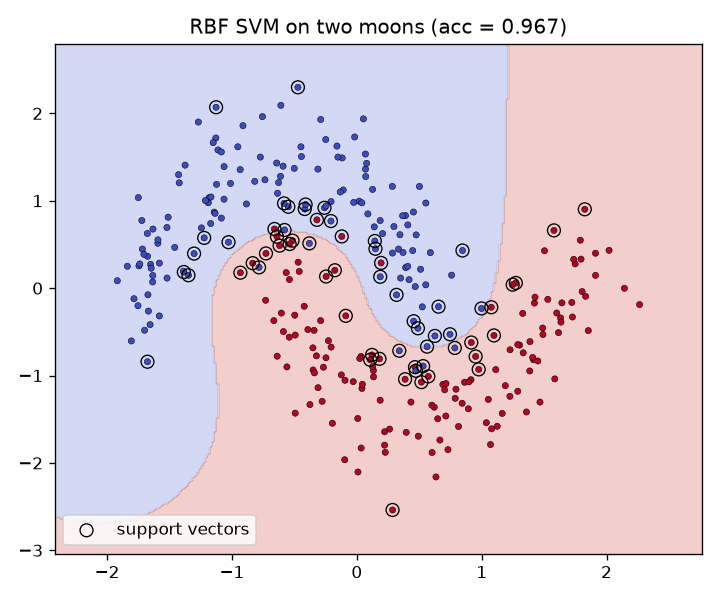
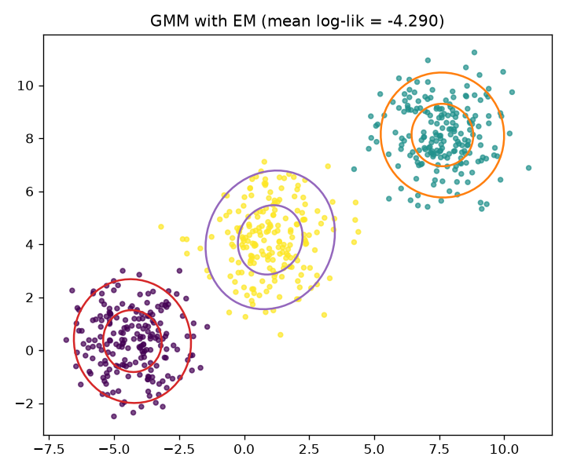
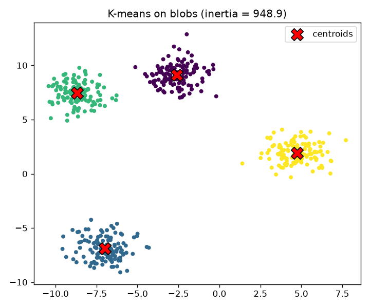
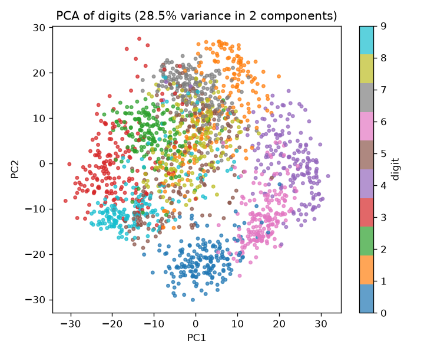

# classical-ml-from-scratch

Core classical machine learning algorithms implemented from scratch in NumPy, with a
consistent fit/predict estimator API and unit tests that validate every implementation
against its scikit-learn counterpart on toy datasets.

## Algorithms

| Estimator | Method | Module |
|---|---|---|
| `LinearRegression` | Normal equations (lstsq) and batch gradient descent | `classml/linear_regression.py` |
| `LogisticRegression` | Batch gradient descent, binary and one-vs-rest multiclass, optional L2 | `classml/logistic_regression.py` |
| `KMeans` | Lloyd's algorithm with k-means++ seeding and restarts | `classml/kmeans.py` |
| `PCA` | SVD of the centered data, transform and inverse transform | `classml/pca.py` |
| `KernelSVM` | RBF kernel, soft margin, simplified SMO dual solver | `classml/svm.py` |
| `GaussianMixtureEM` | Full-covariance EM in log space, k-means initialisation | `classml/gmm.py` |

Every estimator follows the same interface: `fit(X, y)` returns `self`, then
`predict(X)`, plus `transform` for PCA, `predict_proba` where probabilities make
sense, and `score` (accuracy, R2, or mean log-likelihood as appropriate). scikit-learn
is a test-time reference and data source only, none of the algorithm code depends on it.

## Install

```
git clone https://github.com/aamirmalik-dr/classical-ml-from-scratch.git
cd classical-ml-from-scratch
python -m venv .venv
.venv\Scripts\activate        # Windows, use: source .venv/bin/activate on Linux/macOS
pip install -e ".[dev]"
```

Requires Python 3.11 or newer.

## Run

```
python scripts/demo.py        # runs every algorithm, writes figures to results/
python scripts/download_data.py   # verifies dataset availability (all sklearn loaders, fully offline)
pytest -q                     # 29 tests comparing against sklearn references
```

There is also a short walkthrough notebook at `notebooks/demo.ipynb` with executed
outputs.

## Results

All numbers below were produced by running `python scripts/demo.py` in a fresh
virtual environment (Python 3.11.9, NumPy 1.26+, scikit-learn 1.4+).

Linear regression, diabetes dataset (standardised features):

- R2 closed form 0.5177, gradient descent 0.5177, sklearn reference 0.5177
- max absolute coefficient difference vs sklearn: 7.8e-14

Logistic regression, two moons (n=400, noise 0.25):

- training accuracy 0.8675 (a linear boundary caps accuracy on this dataset by design)

RBF kernel SVM (simplified SMO), two moons (n=300, noise 0.2):

- training accuracy 0.9667, identical to sklearn `SVC(C=1.0, gamma=1.0)` at 0.9667
- 64 support vectors out of 300 samples

K-means, 4 Gaussian blobs (n=500):

- inertia 948.89 vs sklearn 948.89
- adjusted Rand index 1.0000 vs both sklearn labels and true labels

PCA, digits dataset (64 features):

- explained variance ratio PC1 0.1489, PC2 0.1362, 28.5 percent in two components
  (matches sklearn to 1e-8 in the unit tests)

Gaussian mixture EM, 3 Gaussian blobs (n=600):

- converged in 20 EM iterations at tol 1e-6, log-likelihood monotone non-decreasing
- mean log-likelihood -4.2900 vs sklearn -4.2900, ARI 1.0000 vs sklearn cluster labels

Example figures produced by the demo (committed copies live in `docs/figures/`,
fresh ones are written to the gitignored `results/` directory on every run):

| | |
|---|---|
|  |  |
|  |  |

## Scope and limitations

- Educational, clean-room implementations written from the underlying math. They are
  correct on the toy problems they are tested on but not tuned for speed or scale;
  use scikit-learn for real workloads.
- `KernelSVM` is binary only and uses the simplified SMO heuristic, which converges
  more slowly than a full working-set SMO.
- `LogisticRegression` multiclass is one-vs-rest, not true multinomial softmax.
- `GaussianMixtureEM` fits full covariances only, no tied/diagonal/spherical options.
- No sparse input support, everything is dense float64.

## Project layout

```
src/classml/     library code, one module per algorithm
scripts/         demo.py (end-to-end run with figures), download_data.py
notebooks/       demo.ipynb, executed walkthrough
tests/           pytest suite, each algorithm checked against sklearn
docs/figures/    committed copies of the demo figures shown in this README
data/            unused, kept for layout consistency (all data is from sklearn loaders)
```

## Development

```
ruff check src tests scripts
black src tests scripts
pytest -q
```

CI runs ruff and pytest on Ubuntu with Python 3.11 for every push and pull request.

## Author

Aamir Malik

- GitHub: https://github.com/aamirmalik-dr
- LinkedIn: https://linkedin.com/in/dr-aamirmalik

## License

MIT, see [LICENSE](LICENSE).
