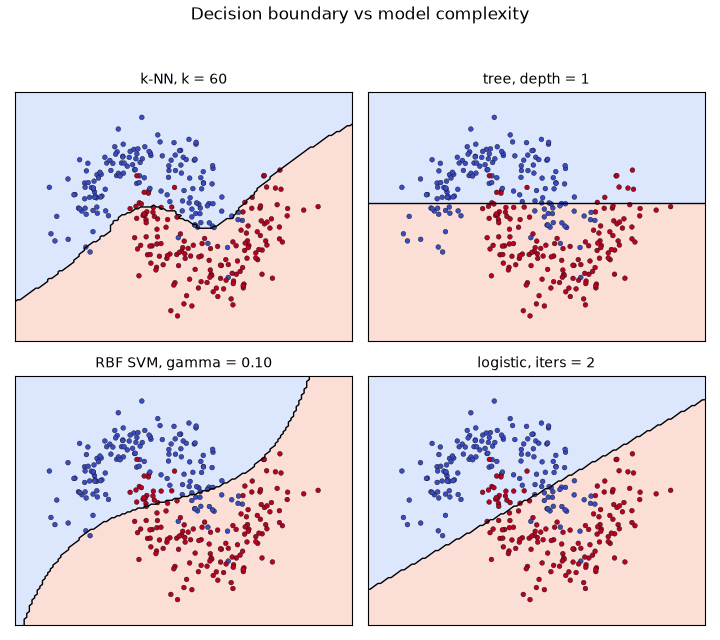
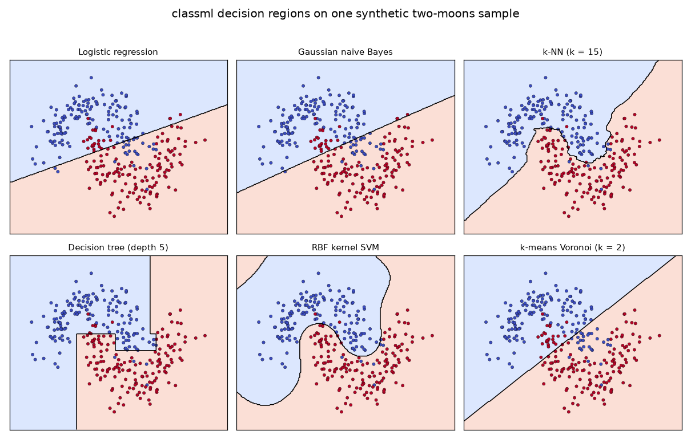

# classical-ml-from-scratch

*Origin: Originally developed for the Machine Learning for AI course at KAIST (Spring 2021); refactored and open-sourced in July 2026.*



Watch four estimators sweep their complexity knob in lockstep on the same
synthetic two-moons sample: k-nearest-neighbours goes from many neighbours to one,
the decision tree grows deeper, the RBF support vector machine widens its kernel,
and logistic regression trains for more iterations. Every boundary above is drawn
by an estimator written from the underlying math in plain NumPy, with no
scikit-learn in the algorithm code.

## The gallery

One synthetic sample, six decision regions, one shared `fit` / `predict` API. This
is the whole point of the package: swapping one model for another is a single
line.



From left to right, top to bottom: the linear boundary of logistic regression, the
quadratic boundary of Gaussian naive Bayes, the piecewise boundary of k-NN, the
axis-aligned boxes of a depth-5 tree, the smooth boundary of an RBF SVM, and the
Voronoi partition of k-means. Regenerate both artifacts with
`python scripts/make_gallery.py`.

## The API

Nine estimators share one contract, borrowed from scikit-learn and implemented
independently:

```python
import numpy as np
from classml import KNeighborsClassifier, DecisionTreeClassifier, KernelSVM

table = np.loadtxt("data/sample_moons.csv", delimiter=",", skiprows=1)
X, y = table[:, :2], table[:, 2].astype(int)

model = KNeighborsClassifier(n_neighbors=15).fit(X, y)   # fit returns self
model.predict(X[:5])                                     # -> array of labels
model.score(X, y)                                        # -> accuracy

# every classifier is a drop-in replacement
for est in (DecisionTreeClassifier(max_depth=5), KernelSVM(gamma=1.0)):
    print(est.fit(X, y).score(X, y))
```

`fit(X, y)` always returns `self`. Classifiers add `predict` and `score`
(accuracy), most add `predict_proba`; regressors return an R^2 `score`; PCA adds
`transform` and `inverse_transform`. Fitted attributes carry a trailing
underscore. The full contract lives in `classml.base`, and adding your own
estimator is a short subclass, shown in `examples/custom_estimator.py`. The
complete reference is in [docs/api.md](docs/api.md).

## The estimators

| Estimator | Kind | Method |
|---|---|---|
| `LinearRegression` | regressor | normal equations or batch gradient descent |
| `LogisticRegression` | classifier | batch gradient descent, one-vs-rest, optional L2 |
| `KNeighborsClassifier` | classifier | lazy Euclidean vote, uniform or distance weights |
| `DecisionTreeClassifier` | classifier | CART, greedy Gini-impurity splits |
| `GaussianNB` | classifier | per-class Gaussians scored in log space |
| `KernelSVM` | classifier | RBF kernel, soft margin, simplified SMO dual |
| `KMeans` | clustering | Lloyd's algorithm, k-means++ seeding, restarts |
| `PCA` | decomposition | SVD of the centered data |
| `GaussianMixtureEM` | clustering | full-covariance EM in log space |

scikit-learn appears only as a test-time reference and a data source. None of the
algorithm code imports it.

## Install and run

```
git clone https://github.com/aamirmalik-dr/classical-ml-from-scratch.git
cd classical-ml-from-scratch
python -m venv .venv
.venv\Scripts\activate        # Windows; use source .venv/bin/activate elsewhere
pip install -e ".[dev]"
```

Requires Python 3.11 or newer. Then, all offline on the committed sample:

```
python examples/quickstart.py          # fit and predict in a few lines
python examples/compare_classifiers.py # every classifier through the shared API
python bench_vs_sklearn.py             # each estimator vs its sklearn reference
python scripts/make_gallery.py         # regenerate the gallery and the hero GIF
pytest -q                              # 43 tests, each checked against sklearn
```

There is also a narrated walkthrough at `notebooks/demo.ipynb` with executed
outputs.

## Validation against scikit-learn

Numbers below were produced by `python bench_vs_sklearn.py` in a fresh Python
3.11 virtual environment (NumPy 2.x, scikit-learn 1.4+). Each row fits the
from-scratch estimator and the matching scikit-learn estimator on the same toy
dataset. The results file is committed at `results/metrics.json`.

| Estimator | Dataset | Metric | classml | scikit-learn |
|---|---|---|---|---|
| LinearRegression | diabetes | R2 | 0.5177 | 0.5177 |
| LogisticRegression | two moons | accuracy | 0.8675 | 0.8675 |
| KNeighborsClassifier | iris | accuracy | 0.9733 | 0.9733 |
| DecisionTreeClassifier | iris | accuracy | 0.9933 | 0.9933 |
| GaussianNB | wine | accuracy | 0.9888 | 0.9888 |
| KernelSVM | two moons | accuracy | 0.9667 | 0.9667 |
| KMeans | blobs | ARI vs truth | 1.0000 | 1.0000 |

Every from-scratch estimator matches its scikit-learn reference to four decimals
on these toy problems. `GaussianNB` reproduces sklearn's per-class means and
variances to nine decimals, and its predictions are identical. PCA and the
Gaussian mixture are checked the same way in the test suite: PCA matches sklearn
to better than 1e-6 on explained variance, and the Gaussian mixture agrees to
about 1e-6 on mean log-likelihood. This is controlled validation on small
datasets, not a benchmark of speed or scale.

## Scope and limitations

- Educational, clean-room implementations written from the math. They are correct
  on the toy problems they are tested on but are not tuned for speed or scale. Use
  scikit-learn for real workloads.
- `KernelSVM` is binary only and uses the simplified SMO heuristic, which converges
  more slowly than a full working-set solver.
- `LogisticRegression` multiclass is one-vs-rest, not true multinomial softmax.
- `KNeighborsClassifier` is brute-force, with no KD-tree or ball-tree index.
- `GaussianMixtureEM` fits full covariances only.
- Everything is dense float64, with no sparse-input support.

## Project layout

```
src/classml/     library code, one module per algorithm, shared base in base.py
examples/        quickstart, classifier comparison, and a custom-estimator recipe
scripts/         generate_sample.py, make_gallery.py, demo.py, download_data.py
bench_vs_sklearn.py   accuracy-vs-sklearn benchmark, writes results/metrics.json
docs/api.md      full API reference
notebooks/       demo.ipynb, executed walkthrough
tests/           pytest suite, each algorithm checked against sklearn
data/            sample_moons.csv, the synthetic offline sample
assets/          decision_boundary.gif (hero) and gallery.png (contact sheet)
results/         metrics.json from the benchmark
```

## Development

```
ruff check src tests scripts examples bench_vs_sklearn.py
black src tests scripts examples
pytest -q
```

CI runs ruff and pytest on Ubuntu with Python 3.11 for every push and pull request.

## Author

Aamir Malik

- GitHub: https://github.com/aamirmalik-dr
- LinkedIn: https://linkedin.com/in/dr-aamirmalik

## License

MIT, see [LICENSE](LICENSE).
